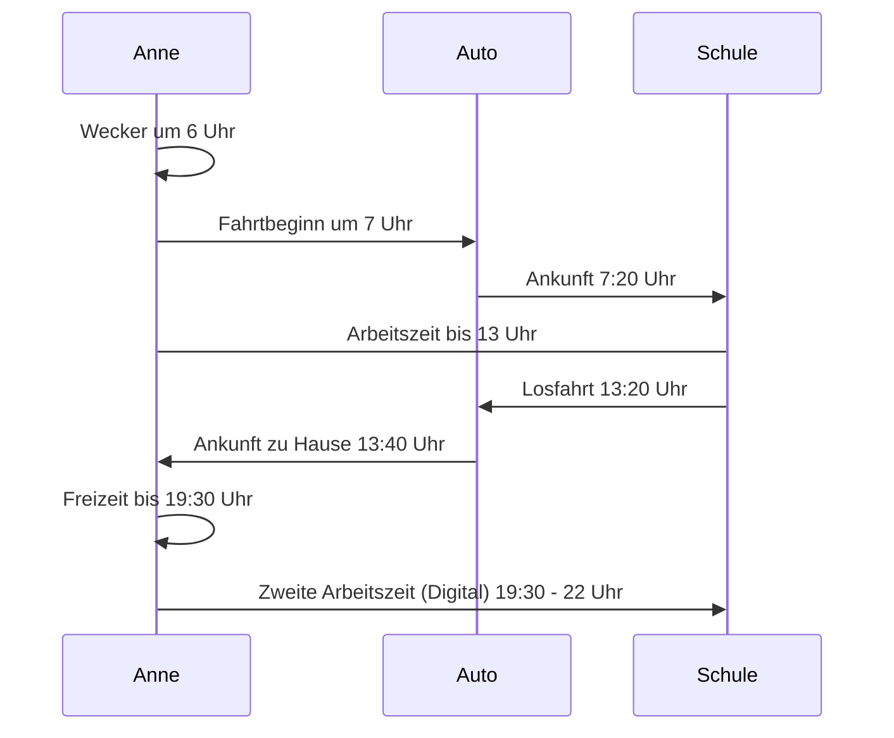

Ablaufdiagramm
===

```mermaid
sequenceDiagram 
	participant Anne
	participant Auto
	participant Schule

    Anne->>Anne: Wecker um 6 Uhr
    Anne->>Auto: Fahrtbeginn um 7 Uhr
	Auto->>Schule: Ankunft 7:20 Uhr
	Anne->Schule: Arbeitszeit bis 13 Uhr
	Schule->>Auto: Losfahrt 13:20 Uhr
	Auto->>Anne: Ankunft zu Hause 13:40 Uhr
	Anne->>Anne: Freizeit bis 19:30 Uhr
	Anne->>Schule: Zweite Arbeitszeit (Digital) 19:30 - 22 Uhr
	
```