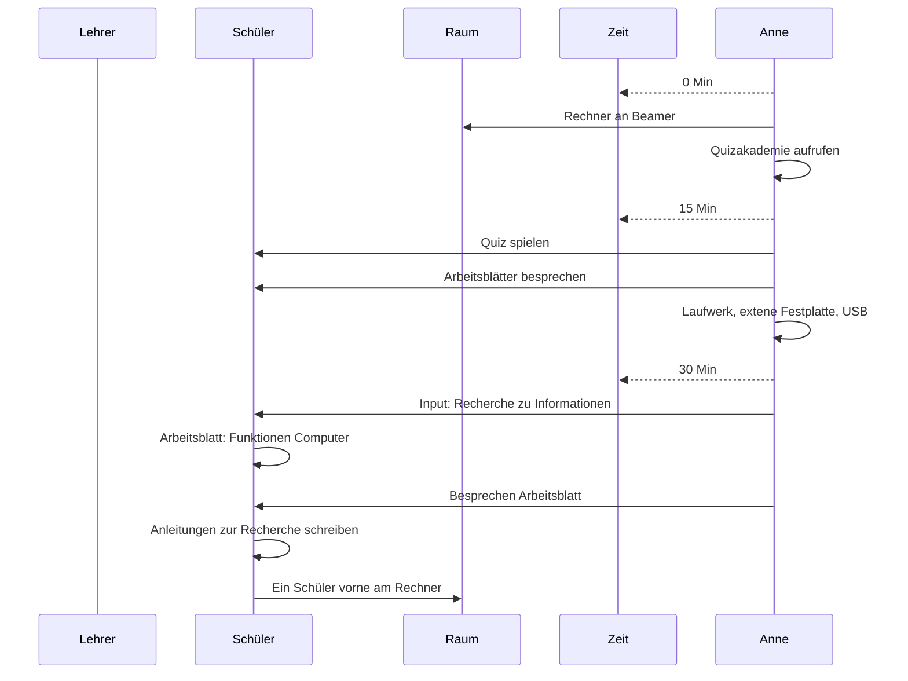
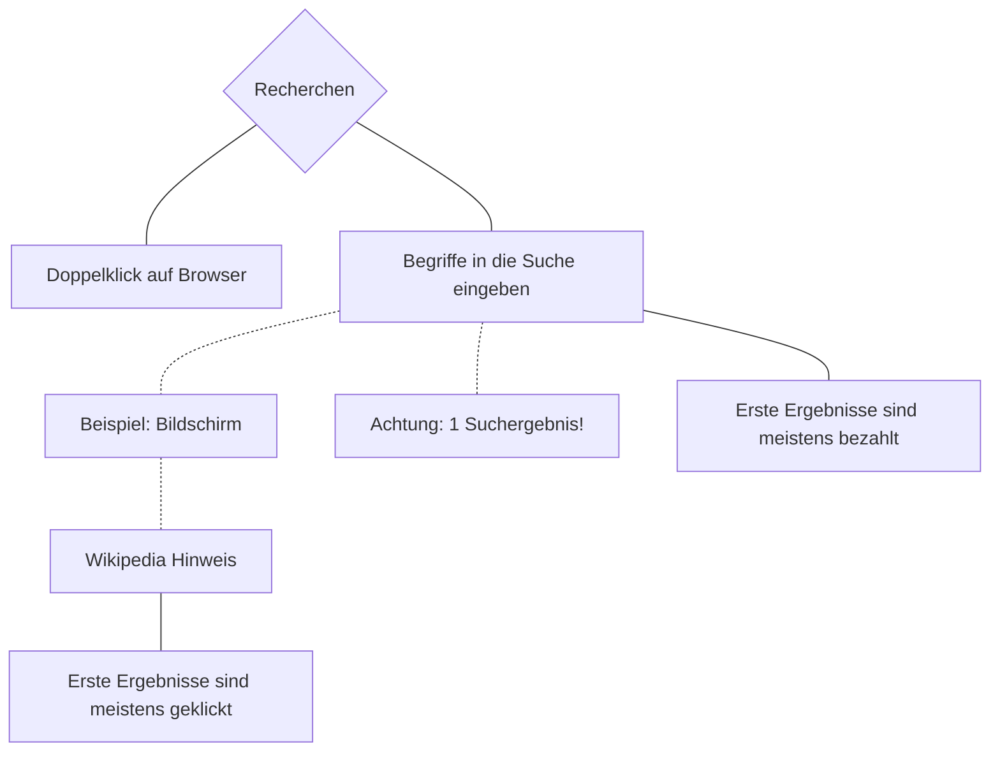

Unterrichtseinheit Internet-Recherche
===

```mermaid
sequenceDiagram 
	participant Lehrer
	participant Schüler
	participant Raum
	participant Zeit
	
	Anne-->>Zeit: 0 Min
	
    Anne->>Raum: Rechner an Beamer
	Anne->>Anne: Quizakademie aufrufen
	
	Anne-->>Zeit: 15 Min
	Anne->>Schüler: Quiz spielen
	Anne->>Schüler: Arbeitsblätter besprechen
	Anne->>Anne: Laufwerk, extene Festplatte, USB
	
	Anne-->>Zeit: 30 Min
	Anne->>Schüler: Input: Recherche zu Informationen
	Schüler->>Schüler: Arbeitsblatt: Funktionen Computer
	Anne->>Schüler: Besprechen Arbeitsblatt
	Schüler->>Schüler: Anleitungen zur Recherche schreiben
	Schüler->>Raum: Ein Schüler vorne am Rechner
```

## Beispiele für Recherchen:

```mermaid
flowchart TD
r{Recherchen}

r --- 1[Doppelklick auf Browser]
r --- 2[Begriffe in die Suche eingeben]
2 -.- 2.1[Beispiel: Bildschirm]
2 -.- 2.11[Achtung: 1 Suchergebnis!]
2.1 -.- 2.12[Wikipedia Hinweis]
2 --- 2.121[Erste Ergebnisse sind meistens bezahlt]
2.12 --- 2.122[Erste Ergebnisse sind meistens geklickt]
```
